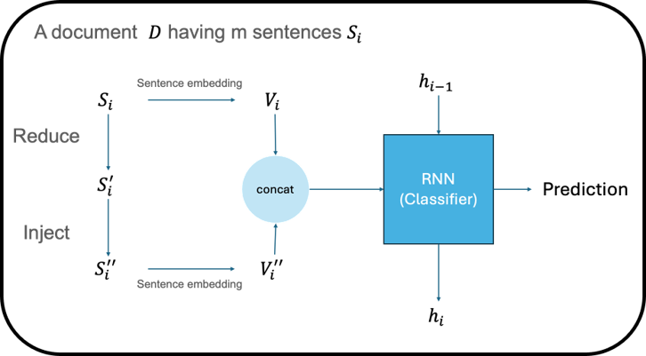

# CSE403 Deep Learning Project

This repository contains the source code and documentation for the CSE403 Deep Learning Final Project. The project focuses on AI-generated text detection using various backbone models, including Llama and GPT-2.

## Project Structure

- **`src/`**: Contains Python scripts for data preprocessing, model training, and evaluation.
  - `hc3/`: Scripts related to the HC3 (Human ChatGPT Comparison) dataset.
  - `HC3_domain/`: Domain-specific analysis using the HC3 dataset.
  - `llm-generate/`: Scripts for generating and analyzing LLM text.
- **`docs/`**: Project documentation, including the final report and presentation slides.
- **`assets/`**: Visual assets and figures used in the project.
- **`data/`**: Placeholder for dataset files (ignored by Git if applicable).

## Visual Overview



## Key Features

- **Backbone Models**: Utilization of Llama-1B, GPT-2 XL, and Qwen-2.5-VL-1.5B for feature extraction and detection.
- **Detection Strategies**: Implementation of DetectGPT and other sequence-based detection methods.
- **Dataset**: Comprehensive analysis using the HC3 dataset and custom-generated LLM datasets.

## How to Run

1. Preprocess the dataset:
   ```bash
   python src/1_preprocess_dataset_colab.py
   ```
2. Create embeddings:
   ```bash
   python src/2a_create_all_embeddings_colab.py
   ```
3. Train the detector:
   ```bash
   python src/2b_train_with_embeddings_colab.py
   ```

## Contributors

- Members of the CSE403 Deep Learning Course.
